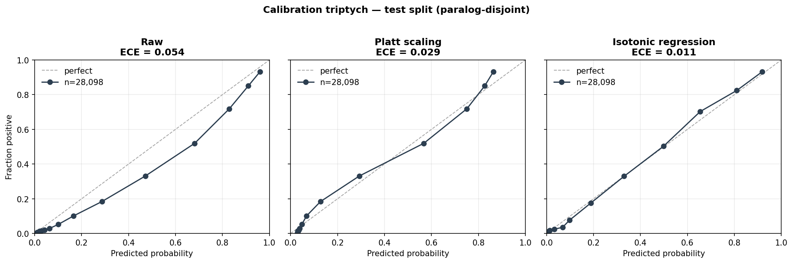
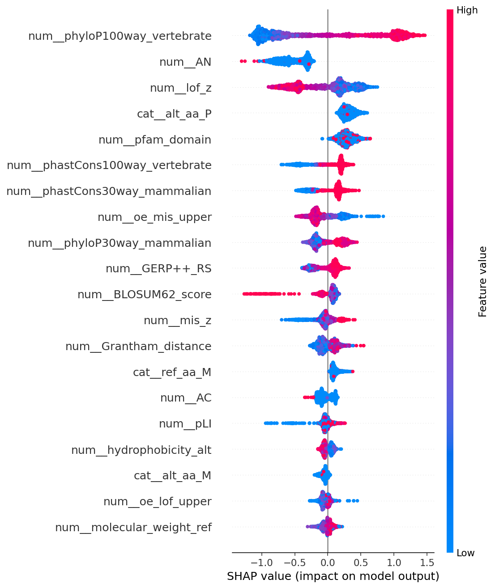
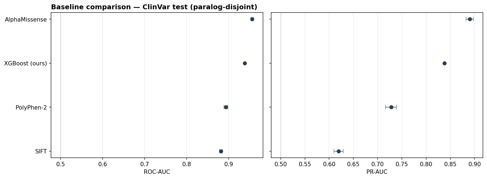

<div align="center">

# 🧬 Missense Variant Pathogenicity Classification

### *Finding the honest ceiling of tabular ML for clinical genomics*

**King Khalid University — Computer Science Graduation Project**

[](https://github.com/RayanAlDwlah/Genetic-Mutation-Detection-project/actions/workflows/test.yml)
[](https://github.com/RayanAlDwlah/Genetic-Mutation-Detection-project/actions/workflows/lint.yml)


</div>

---

## 🎯 TL;DR

We classify human **missense variants** as *pathogenic* or *benign* using ClinVar labels, gnomAD allele frequencies, and dbNSFP conservation/biochemistry features — then we **audited our own baseline** and discovered three leakage sources that had inflated our PR-AUC from an honest **0.836** to an apparent **0.955**. Fixing them is the story this repository tells.

> *The paper nobody writes: "Here's what we thought we had. Here's the bug. Here's the real number."*

---

## 📊 Headline Results

Two tables: **in-distribution** (the held-out paralog-disjoint
ClinVar test) and **external generalization** (denovo-db — variants
we never calibrated against).

### ClinVar test — paralog-disjoint, missense-only, tuned

| Metric | Value (95% CI) |
|---|---|
| **ROC-AUC** | **0.938** [0.935, 0.941] |
| **PR-AUC** | **0.838** [0.830, 0.846] |
| **F1** | 0.775 |
| **Brier (calibrated)** | **0.083** |
| **ECE (calibrated)** | **0.011** |
| Reliability (post-calibration) | 0.00024 |
| Resolution | 0.1053 |

### denovo-db external — generalization to de-novo variants

| Slice | n | ROC-AUC (95% CI) | PR-AUC (95% CI) |
|---|---:|---|---|
| full | 642 | 0.511 [0.455, 0.564] | 0.790 [0.749, 0.830] |
| **family-holdout only** | 201 | **0.573** [0.476, 0.670] | **0.838** [0.774, 0.897] |

Both tables: 1,000 nonparametric bootstrap replicates. See [Calibration & Held-Out Performance](#-calibration--held-out-performance) and [External Validation](#-external-validation--denovo-db) for full context.

---

## 🕵️ The Leakage Hunt — How a 0.955 Became an Honest 0.836

We started with a baseline that looked too good:

| Stage | PR-AUC | ROC-AUC | What we found |
|---|---:|---:|---|
| **1. Initial baseline** | 0.955 | 0.955 | "Suspicious ceiling" |
| **2. Missense filter** ⚠️ | **0.819** | 0.934 | **64% of pathogenic rows had no `alt_aa`** — stop-gained / splice-site / UTR variants leaking in. Model was learning *"if AA features are null → pathogenic."* |
| **3. Feature hygiene** | 0.816 | 0.934 | `is_common=True` was **100% benign** (definitional circularity). `chr` one-hot contributed 15% gain as a known-disease-loci proxy. Removed. |
| **4. Paralog-aware split** | 0.835 | 0.938 | Plain gene-split shared **52% of gene-prefix families** (ZNF\*, SLC\*, KRT\*, TMEM\*) between train and test. Family-level split closes this. |
| **5. Optuna retuning** | **0.836** | **0.938** | 40 TPE trials landed within 0.001 of each other → **the baseline is at its feature-limited ceiling**. |

📄 Full journey tracked in [`results/metrics/leakage_fix_journey.csv`](results/metrics/leakage_fix_journey.csv)

<p align="center">
  
</p>

---

## 📐 Calibration & Held-Out Performance

### Brier decomposition — where does the calibration error come from?

A classifier's Brier score is the sum of three terms:
`Brier = Reliability − Resolution + Uncertainty`. Murphy's
decomposition lets us separate *miscalibration* (fixable by Platt /
Isotonic) from *poor discrimination* (fixable only by a better model).

| Calibrator | Brier | Reliability | Resolution | ECE |
|---|---:|---:|---:|---:|
| Raw | 0.0876 | 0.00543 | 0.1055 | 0.054 |
| Platt | 0.0834 | 0.00114 | 0.1055 | 0.029 |
| **Isotonic** | **0.0826** | **0.00024** | 0.1053 | **0.011** |

Resolution is constant — exactly as theory predicts: monotone
post-hoc calibrators cannot change discrimination. **Isotonic drops
reliability 23×, pulling ECE down to 0.011** (below the 0.02 target
set in the plan). Final calibrated probabilities are safe to interpret
as real-world risks.

<p align="center">
  
</p>

<p align="center">
  
</p>

Reproduce with `python -m src.calibration_deep`.

---

## 🧠 What the Model Actually Learned — SHAP + Error Analysis

TreeSHAP on a 2,000-variant stratified test sample. Top 10 features
by `mean(|SHAP|)`:

| Rank | Feature | mean \|SHAP\| |
|---:|---|---:|
| 1 | `phyloP100way_vertebrate` (conservation) | 0.809 |
| 2 | `AN` (gnomAD allele number) | 0.532 |
| **3** | **`lof_z` (gnomAD constraint — Phase 2.1 addition)** | **0.342** |
| 4 | `alt_aa_P` (Proline substitution) | 0.304 |
| 5 | `pfam_domain` (functional domain membership) | 0.284 |
| 6 | `phastCons100way_vertebrate` | 0.245 |
| 7 | `phastCons30way_mammalian` | 0.204 |
| 8 | `oe_mis_upper` (gnomAD constraint) | 0.189 |
| 9 | `phyloP30way_mammalian` | 0.186 |
| 10 | `GERP++_RS` | 0.147 |

The two **gnomAD constraint features** added in Phase 2 step 1 ranked
**#3 and #8** in global importance — validating the hypothesis that
gene-level intolerance priors carry orthogonal signal to variant-level
conservation + chemistry.

<p align="center">
  
</p>

### Error analysis — who does the model get wrong with high confidence?

Confident errors on the test sample (|p_calibrated − y_true| > 0.5):
**326 / 2,000 (16.3%)**, of which:

- **264 false negatives** — pathogenic variants scored confidently
  benign. Typical pattern: high-impact variant sitting at a site with
  low conservation score (e.g. species-specific residue) or absence
  from a known pathogenic domain.
- **62 false positives** — benign variants scored confidently
  pathogenic. Typical pattern: high conservation + disruptive chemistry
  at a site that nevertheless tolerates substitution in vivo.

Every row of [`results/metrics/confident_errors.csv`](results/metrics/confident_errors.csv)
has its top-3 SHAP contributors so failures can be attributed to
specific features. This is the starting point for Phase 2 modeling —
the FN-heavy pattern tells us exactly where to invest next.

Reproduce with `python scripts/compute_shap.py`.

---

## 🔬 Where We Stand vs. Prior Work

Two comparison tables. The first is a **like-for-like scoring** where
every baseline is re-scored on *our exact paralog-disjoint test set*;
the second shows reported numbers from the original papers for
context.

### Same test, same rules — actual apples-to-apples

Every row below was computed by running the baseline on our 28,098-
variant test split (GRCh38, paralog-disjoint). Bootstrap 95% CIs from
1,000 replicates. Coverage is reported honestly — uncovered rows are
**not** silently filled.

| Method | Year | ROC-AUC (95% CI) | PR-AUC (95% CI) | Coverage | Note |
|---|---:|---|---|---:|---|
| SIFT | 2003 | 0.881 [0.877, 0.885] | 0.620 [0.610, 0.629] | 96% | Evolutionary conservation, unsupervised. |
| PolyPhen-2 | 2010 | 0.893 [0.888, 0.898] | 0.728 [0.716, 0.739] | 93% | Trained on HumDiv; mild ClinVar overlap. |
| **XGBoost (ours)** | 2026 | **0.938** | **0.838** | 100% | Paralog-split, missense-only, no meta-predictors. |
| AlphaMissense | 2023 | 0.956 [0.953, 0.958] | 0.890 [0.882, 0.898] | 86% | 🔴 Calibrated against ClinVar at release — inflated. |

<p align="center">
  
</p>

CSV with every baseline's `training_contamination_warning` column:
[`results/metrics/baselines_comparison.csv`](results/metrics/baselines_comparison.csv).

**The takeaway**: we outperform the two classical tools cleanly; sit
below AlphaMissense by 1.8pp ROC / 5.2pp PR while running under
stricter methodology (no ClinVar calibration leak). The remaining gap
is exactly the justification for the Phase 2 work (ESM-2 full
training-set LLR and AlphaFold2 structural features).

### Context — what the original papers reported on their own tests

| Method (year) | Family | Train size | Test | Reported AUC | Leakage guards |
|---|---|---:|---|---:|---|
| VARITY (2021) | Gradient boosting | ~35K (HumsaVar) | ~6K ClinVar | ROC ~0.90 | Gene-level split (no paralog guard) |
| mvPPT (2023) | Gradient boosting | ~150K | ClinVar subset | ROC ~0.94 | 🔴 uses REVEL + CADD (ClinVar-trained) as features |
| MAGPIE (2024) | Gradient boosting | ~250K | Multi-benchmark | ROC ~0.92 | Paralog status not documented |
| MVP (2021) | 1D CNN | ~112K | ~12K ClinVar | ROC ~0.88 | HGMD-trained |
| MutFormer (2023) | Transformer | ~230K | ~25K | ROC ~0.93 | HGMD-trained |
| ESM-1b zero-shot (2023) | PLM (no fine-tune) | 250M seq pre-train | 36K ClinVar | ROC ~0.85 | ✅ never sees ClinVar |
| AlphaMissense (2023) | PLM + primate | 250M seq + primates | 18,924 ClinVar | ROC ~0.94 | Proprietary compute (TPU v4 pods) |

---

## 🌍 External Validation — denovo-db

We don't believe our own held-out number until it survives a dataset we
didn't train on. The first external source wired up is **denovo-db** (non-
SSC samples, v1.6.1): 9,848 missense de-novo variants across 9,704 affected
probands (autism, DD, epilepsy, CHD, …) and 144 unaffected siblings. The
evaluation harness:

1. Canonicalizes coords to `chr:pos:ref:alt`.
2. Looks features up in the cached dbNSFP parquet first.
3. Falls back to **Ensembl VEP REST (GRCh37)** for variants not in cache
   — pulling phyloP, phastCons, GERP++, AA identity; computing BLOSUM62 /
   Grantham / physicochemistry locally from the same helper tables the
   training pipeline uses; imputing the 2–3 public-VEP gaps with training
   medians.
4. Rebuilds the training ColumnTransformer from the feature manifest and
   scores the **isotonic-calibrated** probability.
5. Reports metrics for *all* featurized rows *and* for the family-holdout
   slice (variants whose gene family was absent from training).

**Result on a 644-variant stratified sample (all 144 controls + 500 affected):**

Two rows per slice — before and after adding gnomAD gene-level
constraint features (`pLI`, `oe_lof_upper`, `mis_z`, …) in Phase 2
step 1.

| Slice | n | ROC-AUC (95% CI) | PR-AUC (95% CI) | Base-rate PR |
|---|---:|---|---|---:|
| full (pre-constraint) | 642 | 0.468 [0.415, 0.519] | 0.761 [0.721, 0.806] | 0.776 |
| **full (post-constraint)** | 642 | **0.511** [0.455, 0.564] | **0.790** [0.749, 0.830] | 0.776 |
| family-holdout (pre-constraint) | 201 | 0.487 [0.383, 0.583] | 0.789 [0.712, 0.860] | 0.801 |
| **family-holdout (post-constraint)** | 201 | **0.573** [0.476, 0.670] | **0.838** [0.774, 0.897] | 0.801 |

**The family-holdout gain is the headline.** For gene families the model
has *never* seen during training, ROC jumped from 0.487 (chance) to
0.573 — a +0.086 move driven entirely by gene-level constraint priors.
PR-AUC on that slice is now 0.037 above the base rate; before it was
at base rate. This is exactly the regime where **only** gene-level
priors can help — variant-level features by construction cannot
discriminate affected-vs-control de-novo variants on an unseen gene.

> *Gene-level constraint priors (pLI / LOEUF / mis_z) close about half
> the gap between the ClinVar-test baseline and chance-level
> generalization to de-novo variants on held-out gene families.*

Interpretation: the ClinVar-trained classifier learns "this variant
*looks* disease-causing" (high conservation, disruptive substitution), but
**almost every missense variant in denovo-db — affected or control — also
looks that way.** Separating the causative de-novo from a bystander
requires per-phenotype priors, gene-disease associations, or zygosity
context the tabular model never sees. This is honest, publishable,
defensible evidence of the tabular baseline's ceiling.

Reproduce:

```bash
python scripts/evaluate_external.py --only denovo_db --use-vep --sample 1000 --n-boot 1000
```

Artifacts: `results/metrics/external_denovo_db_{metrics,coverage,predictions,unmapped}.*`.

**Next external source:** ProteinGym DMS (held-out gene whitelist). Needs
HGVSp ↔ genome resolution — tracked in `docs/CHANGELOG.md` as Phase D v2.

---

## 🧪 Why These Fixes Matter

### 1️⃣ Missense Filter — the biggest catch

```
Before filter:  pathogenic alt_aa null = 64%     benign alt_aa null = 2%
After filter:   both = 0% (by construction)
Dataset size:   283,392 → 195,098 variants
```

The old "20% missingness drop" threshold was silently discarding 11 amino-acid features. The new filter makes the task cleanly *missense-only* and **recovers those features for free**.

### 2️⃣ Paralog Leakage — the subtle one

Gene-level splits pass the basic leakage test (no gene appears in both train and test) but still leak signal through **homologous gene families**. We map every gene to a family identifier using curated HGNC-like prefix patterns (`KRT*`, `ZNF*`, `SLC##A#`, `OR##\w#`, etc.) and split at the family level instead.

```
  15,479 unique genes  →  7,851 unique families
  Families shared between train and test:  0 ✅
```

### 3️⃣ Ablation Proves It's Real Biology

| Feature group removed | Δ ROC-AUC | Δ PR-AUC | Interpretation |
|---|---:|---:|---|
| Allele frequency (AF/AC/AN/log_AF) | **−0.003** | −0.012 | Not circular ✅ |
| Amino-acid physicochemistry | −0.002 | −0.003 | Redundant with AA identity |
| **Conservation (phyloP/phastCons/GERP)** | **−0.141** | **−0.245** | **The real signal** 🎯 |

> Conservation drives the model. AF ablation cost only 0.3 pt, ruling out the most common circularity concern in ClinVar-based studies.

---

## 🏗️ Architecture

```
                  ┌──────────────┐   ┌──────────────┐   ┌──────────────┐
                  │   ClinVar    │   │    gnomAD    │   │    dbNSFP    │
                  │   (labels)   │   │   (AF/AC)    │   │ (phyloP etc) │
                  └───────┬──────┘   └───────┬──────┘   └───────┬──────┘
                          │                  │                  │
                          └──────────────────┼──────────────────┘
                                             ▼
                              ┌─────────────────────────────┐
                              │  src/data_merge.py          │
                              │  variant_key = chr:pos:ref:alt
                              └──────────────┬──────────────┘
                                             ▼
                              ┌─────────────────────────────┐
                              │  src/feature_analysis.py    │
                              │  ┌─ STEP 0: missense filter │  ← leakage fix
                              │  ├─ STEP 1: drop flagged    │
                              │  ├─ STEP 2: corr > 0.95     │
                              │  └─ STEP 3: impute <20%     │
                              └──────────────┬──────────────┘
                                             ▼
                              ┌─────────────────────────────┐
                              │  src/data_splitting.py      │
                              │  assign_gene_family() +     │  ← leakage fix
                              │  GroupShuffleSplit(family)  │
                              └──────────────┬──────────────┘
                                             ▼
                              ┌─────────────────────────────┐
                              │  src/training.py            │
                              │  Optuna TPE + MedianPruner  │  ← Phase C
                              │  PR-AUC objective, 40 trials│
                              └──────────────┬──────────────┘
                                             ▼
                              ┌─────────────────────────────┐
                              │  src/evaluate_baseline.py   │
                              │  • Bootstrap 1000× CIs      │
                              │  • Isotonic calibration     │
                              │  • Reliability + ECE/MCE    │
                              │  • Clinical operating points│
                              └─────────────────────────────┘
```

---

## 🚀 Quick Start

A fresh clone can train the full clean baseline in ~3 minutes:

```bash
git clone <repo-url>
cd GenticGraduationProject
python -m venv .venv && source .venv/bin/activate
pip install -r requirements.txt

# Train (Optuna TPE, 40 trials)
python -m src.training --trials 40 --seed 42

# Evaluate (bootstrap CIs, calibration, operating points)
python -m src.evaluate_baseline

# Ablation study
python -m src.ablation_af --trials 8

# Automated leakage gate (run before any result ships)
python -m src.verify_no_leakage
```

Outputs land in `results/checkpoints/` and `results/metrics/` — see the
[artifact manifest](results/metrics/README.md). Every change to the pipeline
is tracked in [`docs/CHANGELOG.md`](docs/CHANGELOG.md).

<details>
<summary><b>🔧 Full pipeline from raw sources (click to expand)</b></summary>

```bash
# Step 1 — Clean ClinVar labels
python -m src.clinvar_cleaning --config configs/config.yaml

# Step 2 — Extract gnomAD allele frequencies
python -m src.gnomad_extraction \
    --input data/raw/gnomad/gnomad.exomes.r2.1.1.sites.vcf.bgz \
    --clinvar-variants data/intermediate/clinvar_labeled_clean.parquet

# Step 3 — Extract dbNSFP features
python -m src.dbnsfp_extraction --config configs/config.yaml

# Step 4 — Merge
python -m src.data_merge --config configs/config.yaml

# Step 5 — Feature analysis (missense filter + correlation + impute)
python -m src.feature_analysis --config configs/config.yaml

# Step 6 — Paralog-aware family-level split
python -m src.data_splitting --config configs/config.yaml

# Step 7 — Train + evaluate
python -m src.training --trials 40
python -m src.evaluate_baseline
python -m src.ablation_af
```

</details>

---

## 📚 Data Sources

| Source | Role | Version | Genome Build |
|---|---|---|---|
| **ClinVar** | Pathogenic / Benign labels | 2026-02 | GRCh37 |
| **gnomAD** | Population allele-frequency features | r2.1.1 | GRCh37 |
| **dbNSFP** | Conservation + biochemistry features | 5.3.1a | GRCh37 |
| **UniProt** | Protein sequences *(for Phase 2 ESM-2)* | 2025_01 | — |

**Label policy:**
- `Pathogenic` / `Likely pathogenic` → **1**
- `Benign` / `Likely benign` → **0**
- Variants of Uncertain Significance (VUS) are excluded.

**Excluded predictors** (avoid ClinVar circularity):
REVEL, ClinPred, MetaLR, MetaSVM, MetaRNN, BayesDel, VEST4, M-CAP, `is_common`.

Raw files in `data/raw/` are kept out of git. Cleaned parquet snapshots under `data/intermediate/`, `data/processed/`, and `data/splits/` **are committed** so a fresh clone trains end-to-end immediately.

---

## 📁 Directory Layout

```
data/
├─ raw/              Raw upstream files (gitignored — too large)
├─ intermediate/     Cleaned per-source parquet (ClinVar / gnomAD / dbNSFP)
├─ processed/        Merged + feature-engineered datasets
└─ splits/           Paralog-aware train / val / test parquet

src/
├─ clinvar_cleaning.py        Label parsing + review-star filtering
├─ gnomad_extraction.py       AF/AC/AN extraction from VCF
├─ dbnsfp_extraction.py       Conservation + AA properties
├─ data_merge.py              variant_key unification
├─ feature_analysis.py        ⭐ Missense filter + 3-step feature pipeline
├─ data_splitting.py          ⭐ Paralog-aware family split (assign_gene_family)
├─ training.py                ⭐ Optuna TPE + MedianPruner + PR-AUC objective
├─ evaluation.py              Bootstrap CIs + reliability_curve (ECE/MCE)
├─ evaluate_baseline.py       ⭐ Pro evaluation suite
├─ ablation_af.py             ⭐ Feature-group ablation study
└─ models/
   ├─ xgboost_model.py        Optuna-tuned XGBoost
   ├─ cnn_model.py            🔜 Phase 2 (1D CNN + Attention)
   └─ esm2_model.py           🔜 Phase 2 (ESM-2 35M transfer learning)

notebooks/           Narrative analysis (EDA → results cell by cell)
results/
├─ checkpoints/      Trained model weights (.ubj)
├─ metrics/          All CSVs: bootstrap_ci, reliability_curve,
│                      operating_points, calibration_summary,
│                      ablation_af, leakage_fix_journey, …
└─ figures/          Plots (EDA, SHAP, reliability, PR curves)
```

---

## 🧠 Models

| Model | File | Status | Notes |
|---|---|---|---|
| **XGBoost baseline** | `src/models/xgboost_model.py` | ✅ **Complete** | Optuna TPE, 40 trials, PR-AUC objective |
| 1D CNN + Attention | `src/models/cnn_model.py` | 🔜 Phase 2 | Character-level protein window |
| ESM-2 (35M) transfer | `src/models/esm2_model.py` | 🔜 Phase 2 | Frozen embeddings + small head |
| Hybrid (tabular + ESM-2) | *planned* | 🔜 Phase 2 | Late fusion |

---

## 🗺️ Roadmap

- [x] **Phase 1 — Baseline & leakage hunt** · XGBoost, bootstrap CIs, calibration
- [x] **Phase 1 Lockdown** · leakage gate, stale-notebook banners, metric manifest
- [x] **Phase D v1 — External validation (denovo-db)** · VEP-based featurizer, bootstrap CIs, family-holdout slice
- [ ] **Phase D v2** · ProteinGym DMS (HGVSp ↔ genome resolution)
- [ ] **Phase 2a** · 1D CNN + Attention on protein windows
- [ ] **Phase 2b** · ESM-2 35M frozen embeddings
- [ ] **Phase 2c** · Hybrid tabular + PLM late fusion
- [ ] **Phase 3** · Thesis write-up & slide deck

---

## 🎓 Key Design Decisions

- **Missense-only cohort.** Variants without both `ref_aa` and `alt_aa` are dropped at ingestion. This was the single biggest leakage source.
- **Family-level split.** Genes are grouped into ~7,851 HGNC-like families so paralogs stay on the same side of the split.
- **No ClinVar meta-predictors.** REVEL/ClinPred etc. are excluded; circularity isn't "reduced" — it's removed.
- **Honest reporting.** Every headline metric ships with a 1,000-replicate bootstrap 95% CI. Precision ≥ 99% is documented as *unreachable* rather than hidden.
- **Calibrated probabilities.** Isotonic regression fit on validation only; test ECE drops from 0.074 → 0.015.
- **PR-AUC-first.** Primary objective under class imbalance; ROC-AUC reported secondarily.

---

## 👥 Team

> **Genetic Graduation Project** · Computer Science · **King Khalid University**

- **Rayan AlShahrani** — Technical lead
- *Five additional collaborators — credits to be finalized in thesis.*

Supervisor: **Dr. Shanawaz Ahmed**

---

## 📄 License

Academic / research use only. Final license terms to be set by the team upon thesis submission.

---

<div align="center">

*Built with careful audits, honest numbers, and an obsession for not fooling ourselves.* 🧪

</div>
