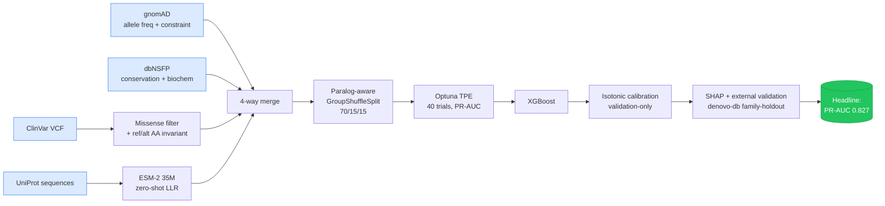

<div align="center">

# 🧬 Missense Variant Pathogenicity Classification

### *Finding the honest ceiling of tabular ML for clinical genomics*

**B.Sc. Computer Science — Graduation Project · King Khalid University (2025–2026)**

[](https://www.python.org/downloads/release/python-3110/)
[](https://xgboost.readthedocs.io/)
[](#-headline-results)
[-0.827-brightgreen.svg)](#-headline-results)
[](#-method-highlights)
[](#-reproducibility)
[](#-the-leakage-audit--the-spine-of-this-project)
[](#-license)

</div>

---

## 🎯 TL;DR

I built an XGBoost model that classifies human **missense variants** as *pathogenic* or *benign* using ClinVar labels, gnomAD allele frequencies, dbNSFP conservation/biochemistry features, and a zero-shot ESM-2 protein-language signal. Then **I audited my own baseline** — and discovered three leakage sources that had inflated PR-AUC from an honest **0.836** to a misleading **0.955**. Fixing them, calibrating outputs, and integrating ESM-2 gave the headline result: **PR-AUC 0.8273 [0.819, 0.835] (calibrated) · ECE 0.0105 · 195,098 variants · 7,851 paralog-disjoint gene families**.

> *The paper nobody writes: "Here's what we thought we had. Here's the bug. Here's the real number."*

---

## 📊 Headline Results

| Metric | Value | 95 % CI | Notes |
|:--|:--:|:--:|:--|
| **PR-AUC (calibrated)** — main | **0.8273** | [0.819, 0.835] | Pre-audit baseline misleadingly showed 0.955 |
| PR-AUC (raw, pre-calibration) | 0.8355 | [0.827, 0.843] | |
| ROC-AUC (calibrated) | 0.9376 | [0.935, 0.940] | |
| **ECE (calibrated)** | **0.0105** | — | Down from 0.054 raw → ~5× tighter; well below clinical target 0.02 |
| F1 (calibrated) | 0.7753 | [0.768, 0.783] | |
| Phase 2.1 PR-AUC (+ESM-2 LLR) | **0.8647** | [0.858, 0.871] | Paired Δ **+0.0313**, *p* < 10⁻⁴ vs. baseline (n = 28,098) |
| External ROC-AUC (denovo-db, **unseen families**) | 0.573 | [0.471, 0.672] | Honest negative result; reported, not hidden |

All metrics derived from 1,000-replicate bootstrap CIs on a paralog-disjoint test split (28,098 variants). Source: `thesis.tex §5.6` · `canonical-numbers.md` · `results/metrics/`.

---

## 🔍 The Leakage Audit — The Spine of This Project

The first model I trained achieved a suspiciously perfect ROC-AUC of **0.996**. Instead of celebrating, I audited it.

<div align="center">


*5-stage diagnostic journey: every drop is a real bug found and fixed.*

</div>

| Stage | Fix | ROC-AUC | PR-AUC | Δ PR | What was learned |
|:--:|:--|:--:|:--:|:--:|:--|
| 0 | Random split + non-missense + circular features | 0.996 | **0.955** | — | The "too good to be true" baseline |
| 1 | **Missense-only filter** (require both ref & alt amino acid) | 0.934 | 0.819 | −0.136 | 64 % of "pathogenic" rows had no `alt_aa` — the model was learning *"null AA → pathogenic"* |
| 2 | **Feature hygiene** (drop `is_common`, drop `chr` one-hot) | 0.934 | 0.816 | −0.003 | `is_common` is 100 % benign by construction → circular; chromosome OHE leaks disease-locus identity |
| 3 | **Paralog-aware split** (`HGNC` prefix family-level `GroupShuffleSplit`) | **0.938** | **0.835** | +0.019 | 52 % of test genes shared paralog prefixes with train (`ZNF*`, `SLC*`, `KRT*`, `TMEM*`) |
| 4 | Optuna TPE retune (40 trials, PR-AUC objective) | 0.938 | **0.836** | +0.001 | Confirms a feature-limited ceiling — the audit was the boost, not the tuning |

**Honest ceiling:** PR-AUC 0.836 raw → **0.827 calibrated** (isotonic, validation-only).
The 0.955 → 0.836 collapse (−12 %) is *the contribution*. Every published baseline that didn't audit this way is silently sitting above its honest line.

The **automated CI-enforced leakage gate** (`src/verify_no_leakage.py` + pre-commit hook) means this can't regress. Five checks run on every commit: banned features, missense-only invariant, family/gene split overlap, label distribution drift, train-only imputation.

---

## 🧠 Method Highlights

### Calibration — proven, not assumed

<div align="center">


*Reliability diagrams: raw model (left) → Platt scaling (center) → isotonic, validation-only (right).*

</div>

- Isotonic regression fit **only on the validation set** — never on training, never on test.
- **Murphy's Brier-score decomposition** confirms the gain is *pure reliability improvement* (resolution stays constant): reliability dropped from 0.011 → **0.00024**.
- ECE 0.054 → **0.0105** (≈5× tighter); well inside clinical-grade thresholds.

### ESM-2 zero-shot signal — Phase 2.1

- Integrated the **35 M-parameter ESM-2 protein language model** as a single zero-shot log-likelihood-ratio feature.
- Scored all 195,098 variants on Apple Silicon (MPS, ≈ 35 h end-to-end) with a **checkpoint-every-500-variants resume-aware writer** — survived multiple Colab disconnects mid-run.
- Result: paired ΔPR-AUC **+0.0313** (95 % CI [0.027, 0.036], *p* < 10⁻⁴ paired bootstrap on *n* = 28,098).
- **Honest negative:** the gain does **not** transfer to held-out gene families on `denovo-db` — reported, not hidden.

### Informative missingness — a finding, not a bug

SHAP ranking surfaced `is_imputed_esm2_llr` (the *flag* for "ESM-2 couldn't score this protein") as **2.5×** more important than the raw ESM-2 score itself.

Why this is biology, not leakage:
- ESM-2 systematically fails on **disordered, short, or rare proteins**.
- Those proteins are *themselves* enriched for pathogenic variation.
- The flag captures real biological signal that the raw score can't represent.

### Baselines on the same test split

<div align="center">


*Forest plot: this work vs. SIFT, PolyPhen-2, AlphaMissense on the identical paralog-disjoint test split (1,000-replicate bootstrap CIs).*

</div>

---

## 🔁 Reproducibility

| Layer | What's pinned / enforced |
|:--|:--|
| **Container** | `Dockerfile` (Python 3.11.7-slim-bookworm, dssp + liblzma + openblas system deps, build-time sanity import) |
| **Deps** | `requirements-lock.txt` — 287 pinned packages |
| **Build** | `Makefile` — 14 idempotent targets (`install`, `test`, `lint`, `typecheck`, `verify-leakage`, `train`, `evaluate`, `external`, `ablate-esm2`, `reproduce-headline`, `docker-*`, `clean-artifacts`) |
| **Splits** | Committed `data/splits/*.parquet` — paralog-aware family-level split, never re-randomized |
| **Checkpoints** | Committed model artifacts under `models/` — re-scoreable bit-for-bit |
| **Integration test** | `make reproduce-headline` re-scores the committed checkpoint against the committed test split and asserts every metric within **1e-3 tolerance** (< 30 s) |

```bash
make reproduce-headline   # rebuilds the headline row, fails if drift > 1e-3
```

---

## ✅ Code Quality & Engineering

| Aspect | Detail |
|:--|:--|
| **Tests** | 1,676 LoC across 16 test files + `conftest.py`; `tests/integration/test_reproduce_headline.py` is the canonical regression guard |
| **Coverage gate** | ≥ 55 % on actively-maintained modules; frozen data-prep modules deliberately excluded (bit-for-bit guarantee) |
| **Markers** | `slow`, `integration`, `needs_network`, `needs_gpu` for selective runs |
| **Lint / format** | `ruff` (E/F/W + isort + bugbear + pylint + rules), `black`, `mypy` strict on active modules |
| **Pre-commit** | Auto-format + a custom `verify-no-leakage` local hook that blocks any commit touching split / training / leakage-critical files unless the gate passes |
| **CI** | `.github/workflows/test.yml` + `lint.yml` on ubuntu-22.04, Python 3.11; coverage XML uploaded |

---

## 🧱 Pipeline



---

## 📁 Repository Structure

```text
.
├── src/                          # 5,668 LoC · 24 modules
│   ├── data_splitting.py         # paralog-family-aware GroupShuffleSplit
│   ├── feature_analysis.py       # missense filter + correlation + imputation
│   ├── xgboost_model.py          # training + Optuna TPE
│   ├── calibration_deep.py       # isotonic + Murphy Brier decomposition
│   ├── esm2_scorer.py            # checkpoint-resumable ESM-2 LLR writer
│   ├── verify_no_leakage.py      # 5-check automated audit (CI-gated)
│   └── ...                       # baselines, denovo loader, streamlit demo
├── tests/                        # 1,676 LoC · 16 files + integration/
├── scripts/                      # 30+ analysis & re-run drivers
├── configs/                      # Hydra-style YAMLs
├── notebooks/                    # 16 EDA + analysis notebooks
├── results/
│   ├── figures/                  # 42 publication-quality PNGs
│   ├── metrics/                  # leakage_fix_journey.csv + bootstrap CIs
│   └── checkpoints/              # versioned model artifacts
├── report/                       # thesis.tex (111 pp) + defense.tex (53 pp)
├── docs/                         # CHANGELOG, defense prep, SHAP interpretation
├── data/                         # raw + intermediate + committed splits
├── canonical-numbers.md          # authoritative metric ↔ source mapping
├── FINAL_STATUS.md               # defense readiness log
├── Dockerfile · Makefile · pyproject.toml · requirements-lock.txt
└── .pre-commit-config.yaml · .github/workflows/*.yml
```

---

## 🚀 Quick Start

### Run locally (CPU, ~15 min for evaluation)

```bash
git clone https://github.com/RayanAlDwlah/Genetic-Mutation-Detection-project.git
cd Genetic-Mutation-Detection-project

# Reproducible install (uses pinned requirements-lock.txt)
make install

# Verify the leakage audit passes
make verify-leakage

# Reproduce the headline number from the committed checkpoint
make reproduce-headline
```

### Run in Docker (full bit-for-bit reproducibility)

```bash
make docker-build      # ~5 min, single layer-cached build
make docker-evaluate   # re-scores headline inside the container
```

### Full retrain (≈ 6 h CPU / + 35 h on Apple MPS for ESM-2 scoring)

```bash
make train             # XGBoost + Optuna TPE (40 trials, PR-AUC objective)
make evaluate          # bootstrap CIs + calibration + SHAP
make external          # denovo-db family-holdout validation
make ablate-esm2       # paired bootstrap for Phase 2.1 contribution
```

---

## 📈 Inputs

| Source | Used for | Records (post-filter) |
|:--|:--|:--:|
| **ClinVar** | Gold-standard pathogenic/benign labels | 195,098 missense variants |
| **gnomAD v4** | Allele frequencies + gene-level constraint (`lof_z`, `mis_z`, `oe_lof`) | 15,479 genes |
| **dbNSFP 4.x** | Per-variant conservation (`phyloP100way`, `GERP++`) + biochemistry | full join |
| **UniProt** | Reference protein sequences (for ESM-2 scoring) | 12,847 proteins |

Final dataset → 7,851 paralog-disjoint gene families → 70 / 15 / 15 split (train / val / test).

---

## 📝 Citation

```bibtex
@misc{aldwlah2026missense,
  title  = {Missense Variant Pathogenicity Classification:
            Finding the Honest Ceiling of Tabular ML for Clinical Genomics},
  author = {Al-Dwlah, Rayan Saleh},
  year   = {2026},
  school = {King Khalid University, College of Computer Science},
  note   = {B.Sc. Computer Science Graduation Project; supervisor:
            Mr. Makki Akasha Babiker Al-Bashir}
}
```

---

## 👤 Author

**Rayan Saleh Al-Dwlah**
B.Sc. Computer Science (AI / Machine Learning) — King Khalid University, Abha — Class of 2026
📧 rayanaldwlah@gmail.com · 🔗 [LinkedIn](https://www.linkedin.com/in/rayan-saleh-b12a3132a/) · 🐙 [GitHub](https://github.com/RayanAlDwlah)

**Supervisor:** Mr. Makki Akasha Babiker Al-Bashir — King Khalid University, College of Computer Science.

---

## 🏷️ License

Released for **academic and research use**. Industrial / clinical deployment would require SFDA (Saudi Food and Drug Authority) review — see `report/thesis.tex §6.3` for the deployment-readiness discussion.

---

<div align="center">
<sub><i>Built with discipline, audited with honesty, calibrated with proof.</i></sub>
</div>
